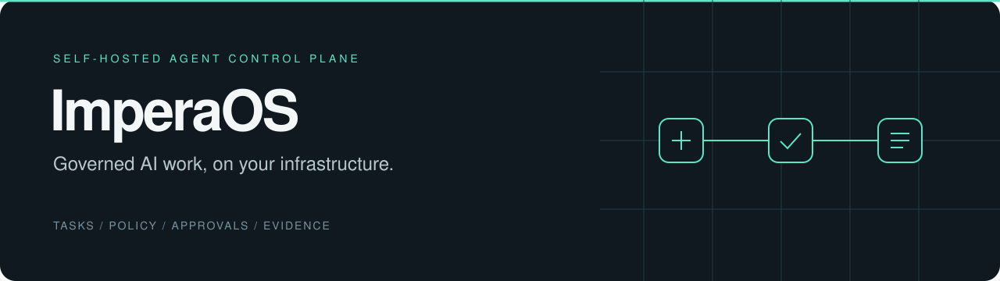
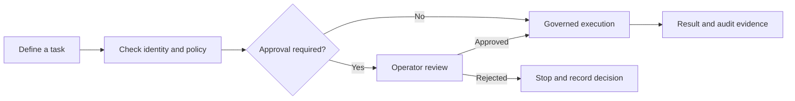

<p align="center">
  
</p>

<p align="center">
  <strong>Assign work. Control permissions. Review the result.</strong><br />
  A self-hosted control plane for AI agents, approvals and verifiable execution.
</p>

<p align="center">
  <a href="#quickstart">Quickstart</a> ·
  <a href="#how-it-works">How it works</a> ·
  <a href="#operator-panel">Operator Panel</a> ·
  <a href="#documentation">Documentation</a> ·
  <a href="docs/AGENT_CONTROL_PLANE_PRODUCT_BOUNDARY.md">Product status</a>
</p>

---

## Why ImperaOS

Running an agent is one part of the job. Deciding what it may access, which
actions need approval, and how to investigate its work matters just as much.

ImperaOS brings those controls into a Python runtime, a CLI and a desktop
Operator Panel. It is designed for developers and operators evaluating governed
agent workflows on their own infrastructure.

| Your workflow | What ImperaOS provides |
|---|---|
| Define who can do what | Agent registration, identity checks and policy evaluation |
| Review consequential actions | Approval requests bound to the proposed execution |
| Coordinate work | Task planning, bounded team execution and checkpoints |
| Control context | Scoped memory and configurable persistence policies |
| Investigate a result | Run history, audit records, replay verification and signed evidence packs |
| Operate from one place | A Tauri desktop panel for tasks, agents, approvals and evidence |

**Current stage:** Operator Panel beta, controlled Team Runtime pilots and a
constrained self-hosted, single-tenant deployment scope. Public desktop installers
require signing and clean-machine evidence. See the
[product boundary](docs/AGENT_CONTROL_PLANE_PRODUCT_BOUNDARY.md) before planning a deployment.

## How it works



The runtime applies configured permissions, execution budgets and failure
handling. Missing authorization stops execution. Evidence records what happened;
replay verification checks trace integrity rather than guaranteeing that an
external business outcome was correct.

## Quickstart

The core requires **Python 3.11** and [uv](https://docs.astral.sh/uv/).
Run these commands from a source checkout:

```bash
git clone https://github.com/bakiacikgoz/ImperaOs.git
cd ImperaOs
uv sync --python 3.11 --extra dev
uv run imperaos --version
uv run imperaos doctor --profile balanced --json
```

The doctor reports missing provider or environment configuration. Model assets
are installed separately; a configured local provider is needed for local model
execution.

### Try a governed workflow

```bash
uv run imperaos setup first-run --profile enterprise --mode local-enterprise --json
uv run imperaos product demo run-governed-workflow --profile enterprise --mode dry-run --json
```

This demonstration uses a deterministic dry run. Inspect the reported checks and
next actions before enabling a real provider. Start with the
[first-run guide](docs/FIRST_RUN_SETUP.md) and
[first real-use workflow](docs/FIRST_REAL_USE_WORKFLOW.md).

## Operator Panel

The desktop interface is built with **React, TypeScript and Tauri**. It provides
task and agent views, an assistant workspace, approvals, run history and evidence
inspection.

For the browser development surface, install Node.js, Corepack and pnpm, then run:

```bash
corepack pnpm --dir apps/operator-panel install
corepack pnpm --dir apps/operator-panel dev
```

For the native desktop application, also install the Rust toolchain and the
platform's Tauri prerequisites:

```bash
corepack pnpm --dir apps/operator-panel tauri:dev
```

See the [desktop configuration and validation reference](docs/PROJECT_REFERENCE.md#operator-panel).

## Architecture

| Layer | Responsibility | Source |
|---|---|---|
| Core runtime | Planning, providers, routing and execution limits | [Runtime](imperaos/runtime) |
| Control plane | Agent registry, run coordination, policy simulation and readiness | [Control plane](imperaos/control_plane) |
| Governance | Policy decisions, approvals and execution authorization | [Governance](imperaos/governance) |
| Team runtime | Bounded coordination, checkpoints and replay | [Team](imperaos/team) |
| Operator Panel | Desktop interface and native bridge | [Panel](apps/operator-panel) |

Computer use is outside the core product. Its implementation is preserved as a
[separate optional extension](extensions/computer-use), with active development
paused. Core installation and release checks do not require it.

## Trust and operational boundaries

- Provider credentials stay in the trusted host environment; the panel does not accept or persist raw API keys.
- Readiness starts at `not_run`. A successful check needs execution evidence.
- Approvals follow `pending → approved → executing → executed → consumed`. An interrupted execution claim requires reconciliation rather than an automatic retry.
- Remote providers are disabled by default and remain subject to provider policy.
- Core state uses `.imperaos`; environment overrides use the `IMPERAOS_` prefix. Legacy state migration is explicit and preserves the source.

Read the [security model](docs/SECURITY_MODEL.md),
[privacy model](docs/PRIVACY_MODEL.md) and
[release checklist](docs/RELEASE_CHECKLIST.md) for deployment details.

## Development

```bash
uv run ruff check .
uv run pytest
corepack pnpm --dir apps/operator-panel test
corepack pnpm --dir apps/operator-panel lint
corepack pnpm --dir apps/operator-panel build
```

On Windows, use a short pytest `--basetemp` path if nested qualification artifacts
exceed the filesystem path limit. Native bridge and end-to-end checks are listed
in the [validation reference](docs/PROJECT_REFERENCE.md#development-and-validation).

## Documentation

| Start here | Go deeper |
|---|---|
| [First-run setup](docs/FIRST_RUN_SETUP.md) | [Architecture](docs/ARCHITECTURE.md) |
| [First real-use workflow](docs/FIRST_REAL_USE_WORKFLOW.md) | [Configuration](docs/CONFIGURATION.md) |
| [Product boundary and status](docs/AGENT_CONTROL_PLANE_PRODUCT_BOUNDARY.md) | [Governed memory](docs/GOVERNED_MEMORY_LAYER.md) |
| [Operations runbook](docs/OPERATIONS_RUNBOOK.md) | [Technical reference: CLI, profiles and deployment](docs/PROJECT_REFERENCE.md) |
| [Release checklist](docs/RELEASE_CHECKLIST.md) | [Paused extension policy](docs/COMPUTER_USE_EXTENSION.md) |

For a bug report, include the relevant command or screen, expected behavior,
actual behavior and a redacted diagnostic output. Never include credentials or
private run content in a public issue.
