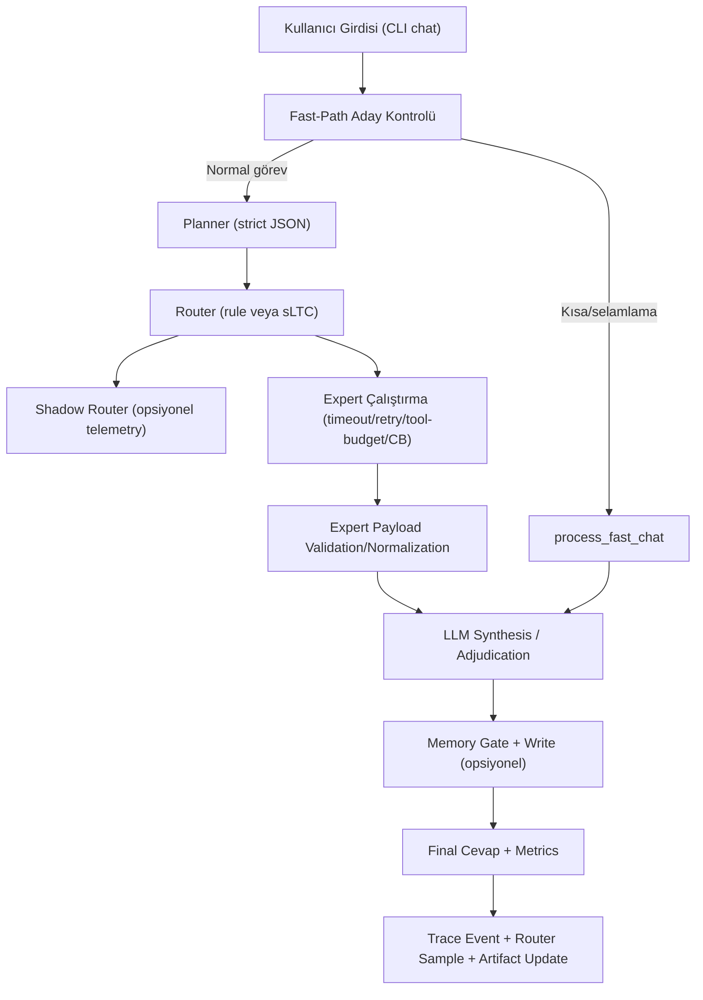

# BinLiquid AI v0.2.x Kapsamlı Teknik Durum Raporu

**Tarih:** 1 Mart 2026  
**Kapsam:** v0.2 çekirdeği + v0.2.x odaklı tuning güncellemeleri  
**Rapor tipi:** Kod tabanı odaklı derin teknik envanter ve güncel durum analizi

---

## 1) Yönetici Özeti

BinLiquid AI, yerel çalışan (offline-first) hibrit bir asistan olarak, `LLM + orchestrator + router + expert + memory + telemetry + benchmark + research` bileşenlerini CLI merkezli üretim hattında birleştiriyor.

Bu rapor tarihindeki güncel durumda:

1. `v0.2` CLI-first reliability hedefleri kodda uygulanmış durumda.
2. `v0.2.x` odak paketi (planner tuning, code verification loop, sLTC calibration, memory salience tuning) entegre edilmiş durumda.
3. Kod kalitesi kapısı (`ruff`, `pytest`) geçiyor.
4. Release gate komutları üretim hattında çalışır ve artifact üretir durumda.
5. Son değişiklikler `main` branch'e commitlenmiş ve remote'a push edilmiştir.

---

## 2) Snapshot (Kod Tabanı ve Repo Durumu)

### 2.1 Git Durumu

- Aktif branch: `main`
- Bu rapor öncesi güncel commit: `7d00cd1`
- Remote: `origin/main` senkron
- Son commitler:
  - `7d00cd1` — `feat(v0.2.x): tune planner, code verification, sltc calibration, and memory salience`
  - `ead8b28` — `feat: implement v0.2 cli-first reliability beta`
  - `81a3349` — `feat: complete binliquid product+research runtime, fast chat, benchmarks and docs`
  - `5a7d2ce` — `feat: bootstrap binliquid v2 product+research foundations`

### 2.2 Kod Tabanı Boyutu (anlık envanter)

- Toplam dosya (repo içi, `.git/.venv` hariç): `193`
- Python dosyası: `87`
- Markdown dosyası: `25`
- JSONL dosyası: `6`
- Toplam Python satırı: `8527`

### 2.3 En Büyük Modüller (satır bazında)

| Dosya | Satır |
|---|---:|
| `binliquid/core/orchestrator.py` | 900 |
| `binliquid/cli.py` | 626 |
| `binliquid/runtime/config.py` | 442 |
| `binliquid/core/planner.py` | 417 |
| `benchmarks/run_smoke.py` | 414 |
| `research/sltc_experiments/train_router.py` | 387 |

---

## 3) Ürün Tanıtımı ve Konumlandırma

BinLiquid AI, küçük bir LLM çekirdeğini (varsayılan `lfm2.5-thinking:1.2b`) aşağıdaki üretim-first yaklaşımıyla kullanır:

1. **LLM text-native üretim hattı**: giriş/çıktı doğal dil üzerinden, strict yapılandırılmış karar şemalarıyla.
2. **Router + expert mimarisi**: görev bazlı uzmanlaşma ile kalite/süre/maliyet dengesi.
3. **sLTC yaklaşımı**: ürün stabilitesini bozmadan routing ve temporal karar mekanizmasında kullanılır.
4. **Yerel gizlilik**: varsayılan `privacy_mode=true`, web kapalı.
5. **Ölçülebilirlik**: benchmark, energy ve research artifact üreten bir değerlendirme hattı.

Bu yaklaşım, “tek bir modelle her şeyi çözme” yerine “karar katmanı + uzman katmanı + doğrulama katmanı” mantığıyla daha kontrollü bir runtime sağlar.

---

## 4) Teknoloji Stack ve Çalışma Ortamı

### 4.1 Runtime ve Dil

- Python `3.11`
- Paket yönetimi/çalıştırma: `uv`
- CLI: `typer`
- Şema doğrulama: `pydantic v2`
- Sistem ölçüm: `psutil`
- LLM runtime: `ollama` (primary), `transformers` (fallback)

### 4.2 Opsiyonel Stack

- `transformers`, `torch` (`hf` extra)

### 4.3 Geliştirici Araçları

- Lint: `ruff`
- Test: `pytest`
- CI: GitHub Actions (`.github/workflows/ci.yml`)

---

## 5) Dizin ve Bileşen Haritası

| Katman | Ana Dizin | Rol |
|---|---|---|
| Uygulama girişi | `binliquid/cli.py` | Komutlar, profile resolve, orchestrator inşa, output modları |
| Çekirdek kontrol | `binliquid/core/*` | Planner, orchestrator, provider client zinciri |
| Router | `binliquid/router/*` | Rule router, sLTC router, research interface köprüsü |
| Expert | `binliquid/experts/*` | Code, research, memory-plan uzmanları |
| Araçlar | `binliquid/tools/*` | Code verify, retrieval, local search, sandbox run |
| Bellek | `binliquid/memory/*` | Salience gate, SQLite store, ranker, session memory |
| Şemalar | `binliquid/schemas/*` | Task/router/expert payload contract modelleri |
| Telemetry | `binliquid/telemetry/*` | Trace event, artifact envelope yazımı |
| Benchmark | `benchmarks/*` | Smoke/ablation/energy koşucular ve raporlama |
| Research | `research/sltc_experiments/*` | Router train/eval/calibration pipeline |
| Dokümantasyon | `docs/*` | Mimari, güvenlik, benchmark protokol, release gate |

---

## 6) Uçtan Uca Çalışma Akışı



Not: Fast-path branch doğrudan hızlı chat yanıtı üretir; normal path planner/router/expert zincirinden geçer.

---

## 7) Provider Mimarisi (Auto + Fallback)

### 7.1 Sağlayıcı Katmanı

- `OllamaLLM` sınıfı artık provider-agnostic client wrapper olarak çalışır.
- Primary provider: `ollama` veya `auto` seçimi.
- Secondary provider: opsiyonel fallback (`transformers`).

### 7.2 Çalışma Prensibi

1. Provider sırası oluşturulur.
2. Primary generate denenir.
3. Hata durumunda fallback provider denenir.
4. Tüm denemeler başarısızsa `LLMGenerationError` yükseltilir.

### 7.3 Sağlık Kontrolü (`doctor`)

- `check_provider_chain` ile primary/secondary health raporu üretilir.
- `auto` modunda primary daemon fail ise selected provider fallback olarak işaretlenebilir.
- Bu raporda gözlenen runtime:
  - Ollama daemon: çalışır
  - Model present: evet
  - Transformers pipeline: yok (heuristic fallback aktif)

---

## 8) Planner Alt Sistemi (Prompt/Repair Tuning)

### 8.1 Tasarım

Planner, LLM çıktısını strict şemaya oturtur:

1. Prompt + system prompt (`strict_v1/v2/v3`) gönderilir.
2. JSON extraction yapılır.
3. Gerekirse one-shot repair uygulanır.
4. Normalize + strict schema validation yapılır.
5. Fail durumunda deterministic heuristic fallback üretilir.

### 8.2 Yeni Tuning Alanları

- `planner_tuning.repair_enabled`
- `planner_tuning.repair_max_attempts`
- `planner_tuning.prompt_variant`

### 8.3 Reason Code Ayrışımı

Planner artık ayrı hata yüzeyleri raporlar:

- `PLANNER_JSON_EXTRACT_FAILED`
- `PLANNER_REPAIR_FAILED`
- `PLANNER_SCHEMA_INVALID`
- `PLANNER_REPAIR_APPLIED`
- `PLANNER_OK`

### 8.4 Deterministik Fallback

Planner parse/repair/schema fail olsa bile süreç çökmüyor; `_heuristic_plan` ile görev tipi ve expert adayları tekrar inşa edilerek akış devam ediyor.

---

## 9) Router Katmanı (Rule + sLTC + Shadow)

### 9.1 Rule Router

- Baseline deterministic karar katmanı.
- Confidence threshold altı doğrudan `llm_only`.
- TaskType bazlı preferred expert seçimi.

### 9.2 sLTC Router

- Temporal membrane state tutar (`ExpertTemporalState`).
- Skorlama girdileri:
  - task bias
  - need bonus
  - confidence bonus
  - failure penalty
  - latency penalty
- Karar reason code’ları:
  - `SLTC_SPIKE`
  - `SLTC_SUBTHRESHOLD`
  - `SLTC_FALLBACK_LLM`

### 9.3 Shadow Mode

Balanced profile’da varsayılan yaklaşım:

- Active router: `rule`
- Shadow router: `sltc`

Orchestrator, active/shadow kararlarını birlikte telemetry’ye yazar:

- `active_router_choice`
- `shadow_router_choice`
- `router_shadow_agreement`
- disagreement bucket metrikleri

### 9.4 Runtime Modu

`config.sltc.router_mode`:

- `active`: sLTC aktif router olur
- `shadow`: sLTC shadow olarak çalışır
- `off`: sLTC devre dışı

---

## 10) Expert Katmanı

### 10.1 Code Expert (güçlendirilmiş verification loop)

Code expert çalışma modeli:

1. Issue type tespit (`syntax/runtime/test/import/config/refactor/generic`).
2. Başlangıç strategy ve patch plan oluşturma.
3. Candidate snippet üretme (duruma göre).
4. `verify_python_snippet` ile aşamalı doğrulama.
5. Failure-aware retry (`retry_max`, `retry_strategy`).
6. Verification sonucuna göre `ok` veya `partial` dönme.

Verification alanları:

- `stage_reached`
- `failure_reason`
- `retry_count`
- `retry_strategy`
- `parse_ok/lint_ok/tests_ok`

### 10.2 Research Expert

- `retrieve_top_chunks` + `find_matches` birleşik kullanımı.
- Çıktı sözleşmesi:
  - `summary`
  - `evidence`
  - `citations` (`path`, `line`, `snippet`)
  - `uncertainty`

### 10.3 Memory Plan Expert

- Deterministik metin parçalama ile `plan_steps` üretir.
- `state_summary`, `memory_candidates`, `confidence` döner.

### 10.4 Compatibility Alias

Legacy isimler korunmuştur:

- `CodeLiteExpert = CodeExpert`
- `ResearchLiteExpert = ResearchExpert`
- `PlanLiteExpert = MemoryPlanExpert`

---

## 11) Araçlar, Sandbox ve Güvenlik

### 11.1 Araç Katmanı

- `local_search.py`: `rg` tabanlı line-level arama.
- `retrieval.py`: local dosya chunk tarama/skorlama.
- `code_verify.py`: parse/lint/collect/targeted test aşamalı doğrulama.

### 11.2 Sandbox Runner

- Komutlar `SandboxRunner` üzerinden çalışır.
- Allowlist dışı komutlar deterministic şekilde reddedilir (`exit_code=126`).

### 11.3 Allowlist

İzinli komut kökleri:

- `rg`, `ruff`, `pytest`, `python`, `uv`

Bu tasarım prompt-injection türü metinlerin doğrudan shell komutu olarak yürütülmesini engeller.

---

## 12) Memory Alt Sistemi (v2 + tuning)

### 12.1 Bileşenler

- `SalienceGate`: spike-benzeri salience kararı
- `PersistentMemoryStore`: SQLite tabanlı kalıcı bellek
- `MemoryManager`: gate + write + prune + retrieval orkestrasyonu
- `SessionStore`: disk dışı ephemeral kısa dönem hafıza

### 12.2 Salience Parametreleri

- `threshold`
- `decay`
- `keyword_weights`
- `task_bonus`
- `expert_bonus`
- `spike_reduction`

### 12.3 Store Özellikleri

- `content_hash` ile dedup
- `expires_at` ile TTL
- `prune_to_limit` ile boyut kontrolü
- expiry-aware arama/retrieval

### 12.4 Retrieval Ranking

Skorlama:

`score = (salience * a) + (recency * b)`

Parametreler:

- `rank_salience_weight`
- `rank_recency_weight`

### 12.5 Metrics

MemoryManager stats:

- `memory_write_rate`
- `dedup_hit_rate`
- `retrieval_hit_rate`
- `retrieval_usefulness_rate`
- `stale_retrieval_ratio`

---

## 13) Orchestrator: Dayanıklılık ve Guardrail Tasarımı

`Orchestrator`, tüm sistemi stabilize eden kritik katmandır.

### 13.1 Guardrail’ler

- `max_recursion_depth`
- `max_tool_calls`
- expert timeout
- retry sınırı
- circuit breaker (`threshold`, `cooldown`)

### 13.2 Fallback Politikaları

- Planner parse fail -> heuristic fallback
- Router low confidence -> LLM-only yol
- CB open -> expert override
- Expert fail/timeout -> fallback expert veya LLM synthesis
- Mixed task conflict -> LLM adjudication

### 13.3 Expert Payload Contract Enforcement

- Expert `status=ok` gelse bile payload pydantic ile validate edilir.
- Invalid payload durumunda `partial + EXPERT_SCHEMA_INVALID` uygulanır.

### 13.4 Fast-path Regret İzleme

Orchestrator session state üzerinden takip eder:

- `fast_path_count`
- `regret_count`
- `followup_correction_rate`
- `fast_path_regret_flag`

---

## 14) Telemetry ve Artifact Sözleşmesi

### 14.1 Tracer

- Her request için stage event kaydı (in-memory).
- Disk yazımı sadece `debug_mode=true` ve `privacy_mode=false` iken aktif.
- Router dataset JSONL yazımı da aynı privacy kapısına bağlı.

### 14.2 Artifact Envelope Standardı

`artifacts/*.json` dosyaları ortak zarf kullanır:

- `artifact`
- `generated_at`
- `status`
- `data`

Zorunlu artifact seti:

- `status.json`
- `test_summary.json`
- `benchmark_summary.json`
- `router_shadow_summary.json`
- `research_summary.json`

---

## 15) Benchmark Sistemi

### 15.1 Koşu Katmanları

- `benchmark smoke`
- `benchmark ablation`
- `benchmark energy`

### 15.2 Ablation Modları

- `A`: LLM-only
- `B`: LLM + Rule Router
- `C`: LLM + sLTC Router
- `D`: LLM + sLTC Router + Memory

### 15.3 Task Suite

- `smoke_tasks.jsonl`
- `quality_tasks.jsonl` (120 görev)
- `planner_failure_cases.jsonl` (adversarial planner corpus)

Quality dağılımı:

- chat: 30
- code: 30
- research: 20
- plan: 20
- mixed: 20

### 15.4 Ölçülen/raporlanan metrikler

- başarı, p50/p95 latency, peak RAM
- wrong route / fallback / expert call
- planner parse/repair/schema/fallback oranları
- router shadow agreement
- expert schema invalid / timeout
- fast-path usage / regret
- memory retrieval & dedup oranları
- energy estimate

---

## 16) Energy Ölçüm Standardı

### 16.1 Ölçüm Modları

- `measured`
- `estimated`

### 16.2 macOS Measured Yol

- `powermetrics` ile CPU power parse edilir.
- Sudo/izin yoksa deterministic fail payload döner.

### 16.3 Schema Alanları

- `measurement_mode`
- `is_privileged`
- `sampling_window_s`
- `tool_name`
- `confidence`
- `error_reason`
- `fallback_estimation_method`
- `platform_info`
- `notes`

Bu ayrım measured/estimated karışmasını engeller.

---

## 17) Research Hattı (Router Train / Eval / Calibration)

### 17.1 Train

- JSONL telemetry’den task bazlı expert preference çıkarır.
- Çıktılar:
  - `router_model.json`
  - `train_metrics.json`
  - `train_report.md`

### 17.2 Eval

- model preference ile dataset actual route eşleşmesini ölçer.
- Metrikler:
  - `exact_match_rate`
  - `success_match_rate`

### 17.3 Calibration

- Parametre sweep + train/holdout değerlendirme
- Objective score bileşimi:
  - agreement
  - success alignment
  - latency compliance
  - fallback cezası
- Çıktılar:
  - `router_calibration_candidates.json`
  - `router_calibration_report.json`
  - `router_calibration_report.md`

---

## 18) Config Mimarisi ve Profiller

### 18.1 Precedence

`defaults < profile < env < CLI`

### 18.2 Temel Profiller

| Profil | Router | Shadow | Memory | Fallback | Debug |
|---|---|---|---|---|---|
| lite | rule | off | off | off | false |
| balanced | rule | sltc | on | on | false |
| research | sltc | rule | on | on | true |

### 18.3 v0.2.x Tuning Alanları

- Planner tuning: `planner_tuning.*`
- Code verify tuning: `code_verify.*`
- sLTC tuning: `sltc.*`
- Memory tuning: `memory.*`

---

## 19) CLI Yüzeyi

Üst komutlar:

- `doctor`
- `chat`
- `benchmark`
- `memory`
- `research`
- `config`

Özellikle `chat` için structured output modları hazırdır:

- `--json`
- `--json-stream`
- `--stdio-json`

Bu yapı, v0.3 thin-shell UI entegrasyonu için IPC-dostu bir zemin sağlar.

---

## 20) Test Matrisi ve Güvence Durumu

### 20.1 Test Envanteri

- Test dosyası: `33`
- Test fonksiyonu: `67`

Kapsanan başlıklar:

1. Planner adversarial parse/fallback
2. Router ve shadow mode davranışı
3. Provider fallback zinciri
4. Expert contract/failover
5. Orchestrator limit/fault injection
6. Memory dedup/TTL/tuning metrikleri
7. Benchmark protocol ve quality suite
8. Energy schema
9. Privacy/safety regression
10. Research reproducibility ve calibration çıktıları

### 20.2 Bu rapor anındaki kapı durumu

- `uv run ruff check .` -> geçti
- `uv run pytest -q` -> geçti
- `uv run binliquid doctor --profile balanced` -> geçti

---

## 21) Doğrulanmış Benchmark ve Research Çıktıları

### 21.1 Quality (120 görev) örnek sonuç

Kaynak: `benchmarks/results/smoke_20260301_172810.json`

- Suite: `quality`
- Task count: `120`
- Mode A/B/C/D raporu üretildi
- Planner parse fail oranı: tüm modlarda `0.0`
- Shadow agreement (B/C/D): `1.0`

Not: Bu örnek koşu provider override ile hızlı doğrulama için yapılmıştır; gerçek model kalitesi kıyasını temsil etmez.

### 21.2 Energy measured örnek sonuç

Kaynak: `benchmarks/results/energy_20260301_172927.json`

- `measurement_mode = measured`
- `measured.ok = false`
- Hata nedeni: `powermetrics` için superuser gereksinimi
- Deterministic payload + estimated fallback alanları doğru üretilmiş

### 21.3 Calibration örnek sonuç

Kaynak: `research/sltc_experiments/artifacts/router_calibration_report.json`

- `sample_count = 12`
- `train_count = 9`
- `holdout_count = 3`
- Best params:
  - `decay=0.82`
  - `spike_threshold=0.5`
  - `failure_penalty_weight=0.25`
  - `latency_penalty_weight=0.08`
  - `need_bonus=0.12`
  - `conf_bonus=0.2`

---

## 22) v0.2.x Güncelleme Kapsamı (Bu Iterasyon)

Bu raporun kapsadığı odak paket, şu 4 kalemin kod seviyesinde uygulanmasıdır:

1. Planner prompt/repair tuning
2. Code expert verification loop güçlendirme
3. sLTC router calibration pipeline
4. Memory salience tuning

İlgili dosyalar arası wiring tamamlanmıştır:

- Runtime config alanları profile/env/CLI resolve hattına bağlandı.
- Orchestrator metrics alanlarına planner/code/memory/router yeni metrikler işlendi.
- Benchmark ve research komutları yeni metrik/artifact setlerini üretir hale getirildi.

---

## 23) Bilinen Sınırlar ve Teknik Riskler

1. `transformers` fallback kalite için değil süreklilik için tasarlanmış durumda.
2. Code expert hâlâ üretken model yerine daha çok kural + doğrulama odaklı çalışıyor.
3. Quality benchmark örneklerinde p50/p95 değerleri, fallback/heuristic run nedeniyle gerçek dünya latency’yi tam temsil etmeyebilir.
4. Research profile varsayılanında `debug_mode=true` ama `privacy_mode=true`; bu nedenle disk telemetry bekleniyorsa explicit privacy kapatma gerekir.
5. sLTC calibration şu an küçük dataset ile demo seviyesinde; gerçek karar iyileşmesi için daha büyük telemetry seti gerekir.

---

## 24) Operasyonel Komut Seti (Önerilen Sıra)

```bash
uv run ruff check .
uv run pytest -q
uv run binliquid doctor --profile balanced
uv run binliquid config resolve --profile balanced --json
uv run binliquid benchmark smoke --mode all --profile balanced
uv run binliquid benchmark ablation --mode all --profile balanced --suite quality
uv run binliquid benchmark energy --profile balanced --energy-mode measured
uv run binliquid research train-router --dataset .binliquid/research/router_dataset.jsonl --output-dir research/sltc_experiments/artifacts --seed 42
uv run binliquid research eval-router --dataset .binliquid/research/router_dataset.jsonl --model research/sltc_experiments/artifacts/router_model.json --output-dir research/sltc_experiments/artifacts
uv run binliquid research calibrate-router --dataset .binliquid/research/router_dataset.jsonl --output-dir research/sltc_experiments/artifacts --seed 42
```

---

## 25) Commit Seti ve Push Durumu

Bu rapor yazımı öncesi güncel baş commit:

- `7d00cd1` (origin/main ile senkron)

Bu rapor dosyası eklendikten sonra yeni commit ve push bu turda ayrıca işlenecektir.

---

## 26) Sonuç

BinLiquid AI, bu an itibarıyla:

1. Çalışan bir v0.2 CLI-first reliability çekirdeğine sahip.
2. v0.2.x tuning paketindeki dört odak işini kod seviyesinde entegre etmiş durumda.
3. Konfigürasyon, telemetry, benchmark ve research pipeline’ları arasında teknik tutarlılığı koruyor.
4. Ürün yolu ile araştırma yolunu ayrıştırarak stabiliteyi korurken iteratif gelişime uygun bir temel sunuyor.

Bu seviyeden sonraki verimli adım, daha geniş gerçek telemetry veri setiyle router/memory tuning kalibrasyonunu derinleştirmek ve code expert’in gerçek patch uygulama döngüsünü güçlendirmektir.
