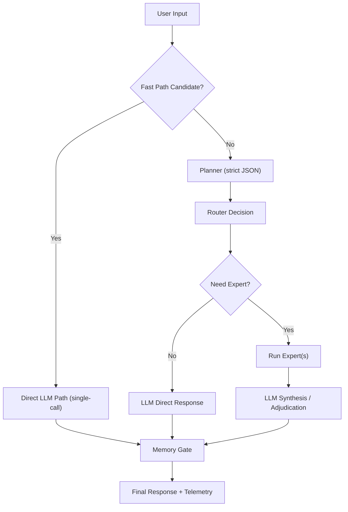

# BinLiquid AI - Kapsamlı Durum ve Yetenek Raporu

Tarih: 1 Mart 2026  
Rapor sürümü: v1.0 (post-implementation audit)

## 1. Yönetici Özeti

BinLiquid AI proje çekirdeği şu anda çalışır, testli ve operasyonel durumdadır.

Sistem şu anda şunları yapabiliyor:

- Türkçe ve İngilizce sohbet (CLI)
- Kısa mesajlarda düşük gecikme için fast-path ve anlık token akışı
- Kod/research/plan görevleri için expert tabanlı hibrit yürütme
- Rule router ve sLTC temporal router ile yönlendirme
- Salience-gated kalıcı hafıza (dedup + TTL + ranked retrieval)
- A/B/C/D benchmark ve enerji ölçüm/estimate çıktıları
- Research pipeline: router training/evaluation reproducible scriptleri

Doğrulama özeti:

- Toplam test: 38
- Lint: geçti
- Test: geçti
- CLI komutları: doctor/chat/benchmark/research yolları çalışır

## 2. Mevcut Ürün Kapsamı

### 2.1 Çekirdek Bileşenler

- LLM katmanı: provider-agnostic (`auto`, `ollama`, `transformers`)
- Planner: strict JSON schema + deterministic fallback
- Orchestrator: timeout/retry/fallback/circuit breaker/tool budget/recursion guard
- Router: rule tabanlı ve sLTC temporal routing
- Experts: `code_expert`, `research_expert`, `plan_expert`
- Memory: SQLite store + salience gate + TTL + dedup + ranked retrieval
- Telemetry: trace event + router training sample JSONL

### 2.2 Kullanıcı Arayüzü

CLI komutları:

- `binliquid doctor`
- `binliquid chat`
- `binliquid benchmark smoke`
- `binliquid benchmark ablation`
- `binliquid benchmark energy`
- `binliquid memory stats`
- `binliquid research train-router`
- `binliquid research eval-router`

## 3. Türkçe Yeteneği ve Model Davranışı

Sistem Türkçe konuşabilir.

- Kısa Türkçe girdilerde fast-path prompt'u dil tespiti yapar ve Türkçe yanıt zorlar.
- Üretim kalitesi en iyi `provider=ollama` + yerel LFM modeliyle alınır.
- `transformers` fallback yolu, runtime sürekliliği içindir; kalite ve akıcılık model/kurulum durumuna bağlıdır.

Önerilen kullanım:

```bash
uv run binliquid chat --profile balanced --provider ollama --stream --fast-path
```

## 4. Uçtan Uca Akış (Algoritmik)



### 4.1 Fast Path (Realtime)

Kısa/gündelik girdilerde planner+router atlanır, tek LLM çağrısı yapılır.

Aday sınıflandırma kriterleri:

- Selamlaşma listesinde ise aday (`selam`, `merhaba`, `hi`, `hello` vb.)
- Maksimum 64 karakter
- Maksimum 10 kelime
- Ağır görev tokenlarını içermeme (`kod`, `python`, `test`, `araştır`, `plan`, `benchmark`, `diff` vb.)

Fast-path avantajı:

- İki model çağrısından tek çağrıya iner
- `--stream` ile token bazlı akış verir

## 5. Planner Algoritması

### 5.1 Ana davranış

- Planner LLM'den strict JSON bekler
- Şema alanları:
  - `task_type`
  - `intent`
  - `needs_expert`
  - `expert_candidates`
  - `confidence`
  - `latency_budget_ms`
  - `can_fallback`
  - `response_mode`

### 5.2 Fallback davranışı

- LLM çağrısı hatası -> heuristic fallback plan
- Parse hatası -> heuristic fallback plan
- `reason_code` sabitleri ile telemetry işaretleme

### 5.3 Heuristic sınıflandırma

- Kod tokenları, research tokenları, plan tokenları tespiti
- Çoklu eşleşmede `mixed` task
- Yoksa `chat`

## 6. Router Algoritmaları

### 6.1 Rule Router

- Confidence düşükse `llm_only`
- Task type'e göre prefer expert seçimi
- Candidate listede yoksa listedeki ilk expert
- Fallback expert ikinci aday

### 6.2 sLTC Temporal Router

Durum değişkenleri expert başına tutulur:

- `membrane`
- `successes`
- `failures`
- `last_latency_ms`

Güncelleme:

- `membrane = decay * membrane + spike_input`
- `spike_input = max(0, task_bias + need_bonus + conf_bonus - failure_penalty - latency_penalty)`
- `failure_penalty = failures / max(successes + failures, 1) * 0.35`
- `latency_penalty = 0.12` (eğer son gecikme budget üstündeyse)

Karar:

- En yüksek skor expert seçilir
- Spike threshold altıysa `llm_only` fallback

## 7. Orchestrator Güvenilirlik Mekanizması

### 7.1 Guardrail seti

- Expert timeout
- Retry limiti
- Circuit breaker
- Tool budget (`max_tool_calls`)
- Recursion depth (`max_recursion_depth`)

### 7.2 Fallback stratejileri

- Planner parse fail -> fallback plan + LLM synth
- Router düşük confidence -> LLM-only
- Expert fail/timeout -> fallback expert -> LLM-only
- Mixed expert çatışması -> adjudication prompt

### 7.3 Circuit breaker

- Ardışık expert hataları threshold'u aşarsa expert cooldown süresince kapatılır

## 8. Expert Katmanı (Şu Anki Uygulama)

### 8.1 Code Expert

Çıktı kontratı:

- `issue_type`
- `strategy`
- `patch_plan`
- `candidate_snippet` (opsiyonel)
- `verification`
- `notes`

Doğrulama adımları:

- AST parse
- `python -m py_compile`
- opsiyonel `ruff check`
- opsiyonel test collect doğrulaması

### 8.2 Research Expert

- `retrieve_top_chunks` + `find_matches`
- Kanıt üretimi `path:line` referanslarıyla
- `uncertainty` hesaplaması

### 8.3 Plan Expert

- Deterministik cümle/parça ayrımı
- Stabil dedup
- `plan_steps`, `state_summary`, `memory_candidates`, `confidence`

## 9. Memory Algoritması (v2)

### 9.1 Salience gate

Input skoru:

- `base(0.05)`
- `keyword_score`
- `length_score = min(len(user_input)/350, 0.2)`
- `task_bonus` (plan/research/mixed/code)
- `expert_bonus`

Toplam:

- `total_input = min(1.0, sum)`
- `membrane = decay * membrane_state + total_input`
- `spike = membrane >= threshold`
- spike sonrası membrane yarıya düşürülür

### 9.2 Kalıcı store

- SQLite tablosu
- `content_hash` ile dedup/upsert
- `expires_at` ile TTL
- prune: önce expired sil, sonra row limit uygula

### 9.3 Retrieval ranking

- `score = 0.7 * salience + 0.3 * recency`
- `recency = 1 / (1 + age_hours/24)`

## 10. Güvenlik Modeli

- Web access default kapalı
- Allowlist dışı komutlar reddedilir
- Tool execution sandbox runner ile yapılır
- Doküman içeriği komut olarak yürütülmez
- Planner strict şema dışı çıktıda fallback çalışır

## 11. Benchmark ve Research Durumu

### 11.1 Benchmark

Kısa örnek koşum (balanced, task-limit 1) sonucu dosyası:

- `benchmarks/results/smoke_20260301_153105.json`

Bu örnek çalışmada A/B/C/D yolları başarılı çalışmış, tümünde `success_rate=1.0` görülmüştür.

Enerji ölçüm örneği:

- `benchmarks/results/energy_20260301_153111.json`
- measured mode: `powermetrics must be invoked as the superuser`

Bu beklenen davranıştır; izin olmadığında deterministic hata detayı dönülür.

### 11.2 Research reproducibility

Artifact'ler:

- `research/sltc_experiments/artifacts/router_model.json`
- `train_metrics.json`
- `train_report.md`
- `eval_metrics.json`
- `eval_report.md`

Örnek eval:

- `exact_match_rate = 1.0`
- `success_match_rate = 1.0`

## 12. Performans Durumu (Pratik)

### 12.1 Önceki yavaşlık sebebi

Selam gibi basit mesajlarda bile:

- Planner çağrısı
- Son cevap çağrısı

Toplam en az 2 LLM roundtrip oluşuyordu.

### 12.2 Uygulanan hız çözümü

- Short-message fast-path -> tek çağrı
- `--stream` -> tokenlar anlık akıyor
- `--fast-path` ile kontrol edilebilir

Örnek komut:

```bash
uv run binliquid chat --profile balanced --provider ollama --stream --fast-path --once "selam"
```

## 13. Çalışma Profilleri

- `lite`
  - düşük kaynak
  - rule router
  - fallback devre dışı
- `balanced`
  - önerilen günlük profil
  - sLTC router
  - fallback aktif
  - persistent memory aktif
- `research`
  - debug ağırlıklı
  - daha geniş limitler
  - araştırma çıktıları için uygun

## 14. Bilinen Sınırlar

- Ollama ve model hızları donanıma bağlı
- measured enerji için superuser izni gerekir
- Transformers fallback quality, yüklü model ve pipeline durumuna bağlı
- Benchmark örnek koşuları küçük task-limit ile hızlı doğrulama amaçlıdır; ürün benchmarkları geniş setle alınmalıdır

## 15. Operasyonel Komut Seti

```bash
# kalite kapısı
uv run ruff check .
uv run pytest -q

# sağlık
uv run binliquid doctor --profile balanced

# hızlı sohbet
uv run binliquid chat --profile balanced --provider ollama --stream --fast-path

# benchmark
uv run binliquid benchmark smoke --mode all --profile balanced
uv run binliquid benchmark ablation --mode all --profile balanced
uv run binliquid benchmark energy --profile balanced --energy-mode measured

# research
uv run binliquid research train-router --dataset .binliquid/research/router_dataset.jsonl
uv run binliquid research eval-router --dataset .binliquid/research/router_dataset.jsonl --model research/sltc_experiments/artifacts/router_model.json
```

## 16. Sonuç

Proje, tanımlanan product-path hedefleri açısından çalışır ve kapalı bir döngüye ulaşmış durumdadır:

- chat/code/research/plan yürütme
- fallback ve güvenilirlik mekanizmaları
- memory lifecycle yönetimi
- benchmark ve research pipeline
- CLI üzerinden gerçek kullanım

Ek olarak, kullanıcı deneyiminde kritik olan "anlık his" için fast-path + streaming uygulanmış ve aktif kullanılabilir hale getirilmiştir.
